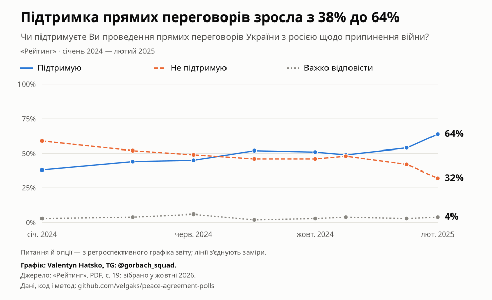
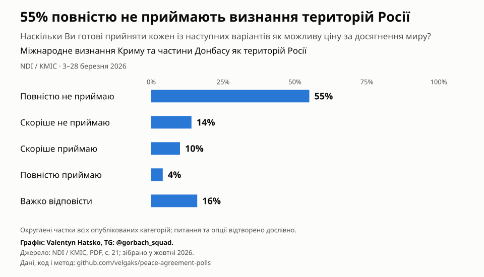

# Опитування про переговори та мирні ініціативи

Опитування українців про переговори, умови миру та можливі поступки від 2022 року.

**[Відкрити графіки →](https://velgaks.github.io/peace-agreement-polls/)**

23 часові ряди та графіки 138 питань із формулюваннями, джерелами й даними для завантаження. Зріз даних: 5 жовтня 2026 року.

[Методологія та відтворення](docs/METHODOLOGY.md) · [Каталог опитувань](data/polls.csv) · [Питання й джерела](data/questions.csv) · [Динаміка](data/dynamics.csv)

Valentyn Hatsko · [@gorbach_squad](https://t.me/gorbach_squad)
